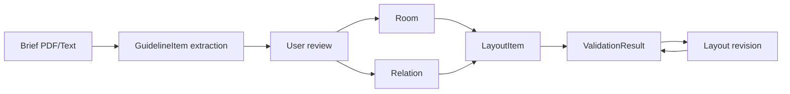

# Data Schema

This document defines the shared data model for Talk Architect. Keep this document aligned with implementation changes.

## Core Entities

- `Room`: room program data
- `Relation`: adjacency or separation rule between rooms
- `GuidelineItem`: extracted requirement from a competition brief
- `LayoutItem`: room position and geometry
- `ValidationResult`: calculated issues and scores

## Room

```ts
type Room = {
  id: string;
  name: string;
  area: number;
  count: number;
  totalArea: number;
  zone: "public" | "private" | "service" | "circulation" | "core";
  floor?: "B1" | "1F" | "2F" | "3F";
  x: number;
  y: number;
  width: number;
  height: number;
  notes?: string;
  status?: "ai_suggested" | "user_confirmed" | "edited" | "conflict";
  source?: SourceReference[];
};
```

Rules:

- `id` must remain stable even if the room name changes.
- `totalArea` should equal `area * count`.
- AI-generated rooms should not silently overwrite user-confirmed rooms.

## Relation

```ts
type Relation = {
  id: string;
  fromId: string;
  toId: string;
  type: "none" | "preferred" | "required" | "separated" | "forbidden";
  weight?: number;
  reason?: string;
  source?: SourceReference[];
  status?: "ai_suggested" | "user_confirmed" | "edited" | "conflict";
};
```

Rules:

- `required`: must be adjacent or very close.
- `preferred`: should be close, but not mandatory.
- `separated`: should keep distance.
- `forbidden`: should not directly touch.
- A relation should eventually carry a reason and source evidence.

## GuidelineItem

```ts
type GuidelineItem = {
  id: string;
  category:
    | "room_area"
    | "room_count"
    | "adjacency"
    | "separation"
    | "floor"
    | "site"
    | "law"
    | "parking"
    | "submission"
    | "evaluation"
    | "unknown";
  title: string;
  content: string;
  appliesToRoomIds?: string[];
  appliesToRelationIds?: string[];
  priority: "required" | "recommended" | "reference";
  source: SourceReference;
  status: "ai_suggested" | "user_confirmed" | "edited" | "conflict";
};
```

## LayoutItem

```ts
type LayoutItem = {
  roomId: string;
  floor: number | string;
  x: number;
  y: number;
  width: number;
  height: number;
  rotation?: number;
  polygon?: { x: number; y: number }[];
  locked?: boolean;
  layer?: string;
  source?: "manual" | "optimized" | "imported_dwg";
};
```

## ValidationResult

```ts
type ValidationResult = {
  score: {
    total: number;
    area: number;
    adjacency: number;
    zoning: number;
    floor: number;
    circulation: number;
  };
  issues: ValidationIssue[];
};

type ValidationIssue = {
  id: string;
  type:
    | "area_mismatch"
    | "room_count_mismatch"
    | "required_adjacency_missing"
    | "forbidden_adjacency_detected"
    | "zoning_conflict"
    | "floor_rule_violation"
    | "circulation_problem"
    | "source_conflict";
  severity: "info" | "warning" | "error";
  title: string;
  description: string;
  relatedRoomIds?: string[];
  relatedRelationIds?: string[];
  relatedGuidelineIds?: string[];
  suggestion?: string;
};
```

## SourceReference

```ts
type SourceReference = {
  documentId?: string;
  documentName?: string;
  page?: number;
  section?: string;
  quote?: string;
  confidence?: number;
};
```

## Data Flow


